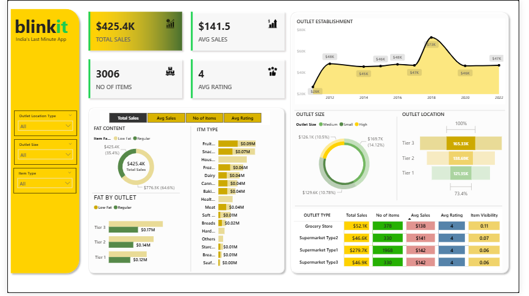

# 📊 Blinkit Sales Analysis – Power BI Dashboard  


---

## 📌 Introduction  
This project showcases a **Power BI Dashboard** analyzing **Blinkit (online grocery delivery) sales performance**.  
The dashboard highlights key insights into revenue, outlet performance, order quantities, and sales distribution to help make better business decisions.  

---

## 🎯 Problem Statement  
Blinkit needs to monitor **outlet-wise sales performance** and **product category demand** in order to:  
- Improve revenue tracking  
- Identify top-performing outlets  
- Optimize supply chain & inventory  

---

## 📂 Dataset  
- Source: Sample Blinkit sales dataset (Outlets, Categories, Orders, Revenue).  
- Rows: ~8K+ transactions  
- Columns: Outlet Size, Outlet Location, Sales, Orders, Category, Date, etc.  
- Data Preparation: Cleaned & transformed in **Power Query**.  

---

## ⚙️ Approach / Process  
1. **Data Cleaning** – removed duplicates, handled missing values.  
2. **Data Transformation** – created measures & calculated columns using **DAX**.  
3. **KPIs Defined** – Total Sales, Average Order Value, Revenue by Category, Outlet Performance.  
4. **Dashboard Design** – interactive visuals with slicers for Outlet Size, Location, and Category.  

---

## 🔑 Key Insights  
- 🏆 **Top 3 outlets** contribute to ~60% of overall revenue.  
- 📦 **Medium-sized outlets** drive maximum order volume.  
- 📈 Sales peak observed in **Q2 (Apr–Jun)** due to festival demand.  
- 🛒 **Fruits & Vegetables** category generates the highest revenue share.  
- 📍 Outlets in **Tier 1 cities** outperform Tier 2 & Tier 3 locations.  

---

## 🛠️ Tools Used  
- **Power BI** → Dashboard & Visualizations  
- **Power Query** → Data Cleaning & Shaping  
- **DAX** → Measures & Calculations  
- **Excel** → Data Source  

---

## 🖼️ Dashboard Preview  
  

---

## 📈 Business Impact  
This analysis enables Blinkit to:  
- Identify high-performing outlets & focus marketing efforts.  
- Optimize **inventory management** for popular categories.  
- Understand demand trends for **better supply chain planning**.  
- Make **data-driven decisions** to improve customer satisfaction.  

---

## 📥 How to Use  
1. Clone this repository:  
   ```bash
   git clone https://github.com/your-username/Blinkit_Dashboard.git

📧 Contact

👤 Zishan Alam
📩 Email: zishanalam101@gmail.com

🔗 LinkedIn: linkedin.com/in/zishan-alam-
